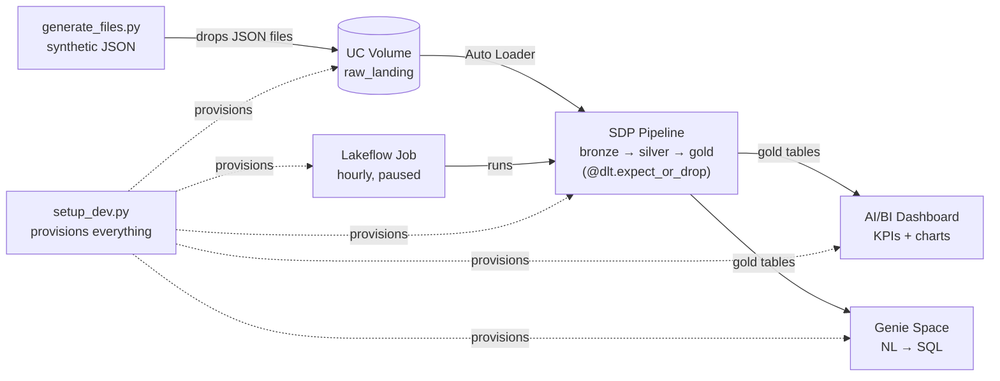

# edetl-workshop

Hands-on Databricks data engineering workshop repo. Generates synthetic legal-domain JSON files, ingests them with Auto Loader through a Spark Declarative Pipeline (SDP), produces a star-schema gold layer, and ships the whole thing as a Databricks Asset Bundle (DAB) with GitHub Actions CI/CD.

The intended workflow:
- **Dev** — clone this repo into a Databricks Git folder, run `setup_dev.py` once to provision pipeline + job + dashboard + Genie space, then iterate in the SDP editor.
- **Stg** — promote to a managed environment via DABs. The workshop demos authoring the bundle YAML from the workspace UI ("Edit as YAML"), then deploying via CLI or the workspace bundle editor.

## What's in here

```
edetl-workshop/
├── databricks.yml                  # Bundle config (single target: stg)
├── resources/
│   ├── storage.yml                 # stg schema + raw_landing volume
│   ├── ingestion_pipeline.yml      # Serverless SDP pipeline resource
│   └── ingestion_job.yml           # Lakeflow Job that runs the pipeline
├── src/
│   ├── setup_dev.py                # One-shot dev setup: schema + volume + files + pipeline + job + dashboard + genie
│   ├── pipelines/
│   │   ├── bronze.py               # Auto Loader streaming tables (4 sources)
│   │   ├── silver.py               # Typed + expectations
│   │   ├── gold.py                 # Aggregates + star-schema join
│   │   └── _transforms.py          # Pure-Python helpers (tested)
│   ├── generator/
│   │   └── generate_files.py       # Synthetic JSON generator (with bad data)
│   ├── dashboards/
│   │   ├── edetl_overview.lvdash.json   # AI/BI dashboard JSON (importable)
│   │   └── SETUP.md                # Manual import path (preferred: setup_dev.py)
│   └── genie/
│       ├── space_template.json     # Genie space serialized payload (placeholders for catalog/schema)
│       └── SETUP.md                # Manual setup path (preferred: setup_dev.py)
├── tests/
│   └── test_transforms.py          # pytest unit tests
└── .github/workflows/
    ├── pr-check.yml                # Validate + tests on PR
    └── deploy.yml                  # Deploy to stg on push to main
```

### Architecture



`setup_dev.py` provisions the volume, pipeline, job, dashboard, and Genie space in one shot. Attendees iterate by re-running `generate_files.py` to drop more files into the volume; Auto Loader picks them up incrementally through bronze → silver → gold, then the dashboard and Genie space pick up the new gold rows. Block B promotes the same pipeline + job to a managed `stg` environment via the DAB.

## Prerequisites

**On your laptop**, before the workshop starts:

1. Clone this repo locally — `setup_dev.py` and `generate_files.py` are run from this directory:
   ```bash
   git clone https://github.com/fabienv-vibes/edetl-workshop
   cd edetl-workshop
   ```
2. **Python 3.10+** with the workshop's pip dependencies:
   ```bash
   pip install databricks-sdk faker pytest
   ```
3. **Databricks CLI** v0.240+ ([install](https://learn.microsoft.com/en-us/azure/databricks/dev-tools/cli/install)), authenticated to your workspace:
   ```bash
   databricks auth login --host https://<your-workspace>
   ```

**In your workspace:**

- A Unity Catalog you can `USE_CATALOG`, `CREATE_SCHEMA`, and `CREATE_VOLUME` on.

`setup_dev.py` and `generate_files.py` run from **your local terminal in the cloned directory** above. They drive the workspace remotely via the Databricks SDK using whatever profile `databricks auth login` configured.

## Workshop flow

### Block A — DE foundations (30 min, hands-on)

Make sure you've completed the [Prerequisites](#prerequisites) before starting Block A.

#### 1. Clone the repo into your workspace as a Git folder

This is a *second* clone, separate from the local one in Prerequisites. The workspace clone is what the SDP pipeline references for its `bronze.py`/`silver.py`/`gold.py` libraries; the local clone is where you run the CLI scripts from.

In the Databricks UI:
- **Sidebar → Workspace** and browse to your home folder (`/Workspace/Users/<your_email>/`)
- Click **Create → Git folder**, paste the URL `https://github.com/fabienv-vibes/edetl-workshop`, click **Create Git folder**
- You'll land at `/Workspace/Users/<your_email>/edetl-workshop/`

#### 2. Run the dev setup script (from your local terminal)

From your **local** clone of the repo (the one in Prerequisites — not the workspace clone), run:

```bash
python src/setup_dev.py --catalog <CATALOG>
```

That single command creates everything for dev:
- Per-user schema `<CATALOG>.edetl_workshop_<your_short_username>` and a `raw_landing` volume
- An initial batch of synthetic JSON files (~5 per fact source, ~5% deliberately malformed)
- A serverless SDP pipeline `edetl-workshop-<your_short_username>` pointing at the .py files in your workspace Git folder
- A Lakeflow Job `edetl-workshop-<your_short_username>` with one task that runs the pipeline (used for the "Edit as YAML" demo in Block B)
- An AI/BI dashboard with KPIs, monthly revenue, practice-area breakdown, top-25 matters table
- A Genie space with 8 sample questions, wired to the silver/gold tables

The script triggers an initial pipeline run and waits for it to finish (~3-5 min cold start), so the dashboard and Genie space have data to query when it returns. URLs for all assets are printed at the end.

It's idempotent — re-run any time and it upgrades existing assets in place.

#### 3. Iterate in the SDP editor

Open the pipeline URL the script printed. The SDP editor lets you walk the bronze/silver/gold code, edit any of the .py files (they live in your workspace Git folder), and hit Run to see your changes. Auto Loader's checkpoint makes re-runs incremental.

#### 4. Drop more files, re-run

```bash
python src/generator/generate_files.py --catalog <CATALOG>
```

Then hit Run on the pipeline again. Bronze grows by exactly the new file count, silver applies expectations and drops the bad rows, gold materialized views recompute. The DAG looks like a star: `silver_matters_master` + 3 silver fact aggregates feed `gold_matter_summary`.

### Block B — CI/CD working session (45 min)

The same pipeline can be promoted to a managed environment via a **Databricks Asset Bundle (DAB)**. We let the workspace UI generate the bundle YAML from the dev job we already have, then use that as the source of truth for CI/CD.

#### 1. Generate bundle YAML from your dev job — the "Edit as YAML" demo (~5 min)

In the workspace UI:
- Open the job `setup_dev.py` created: **Jobs & Pipelines → `edetl-workshop-<short>`**
- Click the kebab menu (⋮) next to **Run now** → **Edit as YAML**
- Bundle-shaped YAML appears, ready to drop into a `databricks.yml` resources file

This is the GA "Collaborate on bundles in the workspace" feature. See [Migrate existing resources to a bundle](https://learn.microsoft.com/en-us/azure/databricks/dev-tools/bundles/migrate-resources) for the canonical doc.

Compare the generated YAML against `resources/ingestion_job.yml` already in this repo — same shape. The bundle is the codified version of what you've been clicking on.

#### 2. Walk the bundle in the workspace bundle editor (~10 min)

- The Git folder you cloned in Block A already contains the bundle
- Navigate to `/Workspace/Users/<your_email>/edetl-workshop/` and open `databricks.yml` in the workspace bundle editor
- Walk the structure together:
  - `databricks.yml` — single target `stg`, required `catalog` variable
  - `resources/storage.yml` — schema + volume
  - `resources/ingestion_pipeline.yml` — serverless SDP pipeline
  - `resources/ingestion_job.yml` — Lakeflow Job (matches the YAML you exported in step 1)

The bundle editor lints, validates, and offers schema-aware IntelliSense — no need to memorise the YAML structure. The `mode: production` target makes the pipeline service-principal-owned, locks names, and runs as the deployer.

See [Collaborate on bundles in the workspace](https://learn.microsoft.com/en-us/azure/databricks/dev-tools/bundles/workspace) for the full feature overview.

#### 3. Promote to stg (~10 min)

Two equivalent paths produce the same `[stg] edetl-edetl_stg` pipeline + hourly job. Pick one for the demo.

**(a) From the workspace bundle editor**: deploy button on the bundle, target `stg`.

**(b) From the CLI**:

```bash
databricks bundle validate -t stg --var "catalog=<CATALOG>"
databricks bundle deploy   -t stg --var "catalog=<CATALOG>"

# Drop files into the new stg volume
python src/generator/generate_files.py --catalog <CATALOG> --schema edetl_stg

databricks bundle run ingestion_job -t stg --var "catalog=<CATALOG>"
```

After the run, `<CATALOG>.edetl_stg` has the same bronze/silver/gold tables, populated.

#### 4. Walk the GitHub Actions (~10 min)

- `.github/workflows/pr-check.yml` — on PR: pytest + `bundle validate -t stg`
- `.github/workflows/deploy.yml` — on push to main: `bundle deploy -t stg`, then optional `bundle run`

Repo secrets needed: `DATABRICKS_HOST`, `DATABRICKS_CLIENT_ID`, `DATABRICKS_CLIENT_SECRET`, `WORKSHOP_CATALOG`.

The full pattern: **workspace UI authors → Git is source of truth → Actions deploy to production**.

#### 5. Live-stub your own `edetl` repo (~10 min)

Following the same skeleton, scaffold an `edetl` directory in your real repo: `databricks.yml`, a `resources/` folder, `src/pipelines/`. We do this together as a working session.

### Block C — Demo extras (10-15 min)

Once stg has data:

- **Dashboard:** import `src/dashboards/edetl_overview.lvdash.json` — see [src/dashboards/SETUP.md](src/dashboards/SETUP.md). KPIs, monthly revenue, practice-area breakdown, doc-action distribution, top-25 matters.
- **Genie Space:** point a Genie Space at the silver + gold tables — see [src/genie/SETUP.md](src/genie/SETUP.md). Sample questions like "Which 10 matters generated the most billable revenue?" and "What's the breakdown of revenue by practice area?" come pre-loaded.

## Pipeline data model

```
matters_master.json     → bronze_matters_master    → silver_matters_master   ─┐
matter_events JSON      → bronze_matter_events     → silver_matter_events    ─┤
time_entries JSON       → bronze_time_entries      → silver_time_entries     ─┼─→ gold_matter_summary
doc_audit JSON          → bronze_doc_audit         → silver_doc_audit        ─┘

                                                  → gold_matter_lifecycle
                                                  → gold_billable_hours_by_matter_month
                                                  → gold_doc_activity_by_matter
```

All silver tables apply `@dlt.expect_or_drop`. The generator's `--bad-data-pct` flag (default 5%) deliberately injects rows that fail those checks (negative hours, unknown event types, missing matter_id) so the SDP UI shows real expectation drops.

## Run tests

```bash
pytest tests/ -v
```

## Customizing for your workspace

In `databricks.yml`, replace the `host:` under `targets.stg.workspace` with your Azure / AWS Databricks workspace URL. Everything else lives behind the `catalog` variable.
