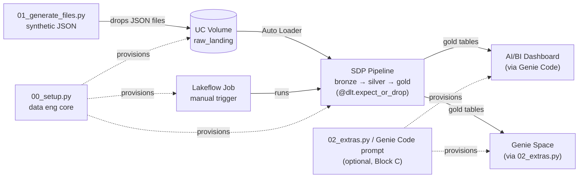

# edetl-workshop

Hands-on Databricks data engineering workshop repo. Generates synthetic legal-domain JSON files, ingests them with Auto Loader through a Spark Declarative Pipeline (SDP), produces a star-schema gold layer, and ships the whole thing as a Databricks Asset Bundle (DAB) with GitHub Actions CI/CD.

The intended workflow — entirely from your Databricks workspace, no local setup:
- **Dev** — clone this repo as a Git folder in your workspace, open `00_setup.py`, set the catalog widget, **Run all**. You get a per-user schema, a serverless SDP pipeline, a Lakeflow Job, an AI/BI dashboard, and a Genie space wired up.
- **Stg** — promote to a managed environment via DABs, authored from the workspace bundle editor ("Edit as YAML"), deployed via the workspace deploy button or CLI.

For production engineering teams who want CLI + GitHub Actions CI/CD, see [Production setup](#production-setup) below — typically a follow-up engagement with your DABs SA / STS team after the workshop.

## What's in here

```
edetl-workshop/
├── 00_setup.py                     # Workshop entry point: dev provisioning notebook (data eng core)
├── 01_generate_files.py            # Notebook: drop more files into your raw_landing volume
├── 02_extras.py                    # Notebook (optional): provisions the Genie space
├── databricks.yml                  # Bundle config (single target: stg)
├── resources/
│   ├── storage.yml                 # stg schema + raw_landing volume
│   ├── ingestion_pipeline.yml      # Serverless SDP pipeline resource
│   └── ingestion_job.yml           # Lakeflow Job that runs the pipeline
├── src/
│   ├── setup_dev.py                # Underlying setup logic (called by 00_setup.py)
│   ├── setup_extras.py             # Underlying Genie space setup (called by 02_extras.py)
│   ├── pipelines/
│   │   ├── bronze.py               # Auto Loader streaming tables (4 sources)
│   │   ├── silver.py               # Typed + expectations
│   │   ├── gold.py                 # Aggregates + star-schema join
│   │   └── _transforms.py          # Pure-Python helpers (tested)
│   ├── generator/
│   │   └── generate_files.py       # Underlying file generator (called by 01_generate_files.py)
│   ├── dashboards/
│   │   ├── edetl_overview.lvdash.json   # Reference AI/BI dashboard JSON (Block C uses Genie Code instead)
│   │   └── SETUP.md                # Manual import path (fallback)
│   └── genie/
│       ├── space_template.json     # Genie space serialized payload (placeholders for catalog/schema)
│       └── SETUP.md                # Manual setup path (preferred: 02_extras.py)
├── tests/
│   └── test_transforms.py          # pytest unit tests
└── .github/workflows/
    ├── pr-check.yml                # Validate + tests on PR
    └── deploy.yml                  # Deploy to stg on push to main
```

### Architecture



Attendees run `00_setup.py` once (which calls `src/setup_dev.py` under the hood) to provision the data engineering core: volume, pipeline, job. They iterate by re-running `01_generate_files.py` to drop more files into the volume; Auto Loader picks them up incrementally through bronze → silver → gold. Block B promotes the same pipeline + job to a managed `stg` environment via the DAB. Optional Block C extras (dashboard via Genie Code, Genie space via `02_extras.py`) sit on top of the gold layer and aren't part of the core flow.

## Prerequisites

The workshop runs entirely from your Databricks workspace. The only thing you need:

- A **Unity Catalog** you have `USE_CATALOG`, `CREATE_SCHEMA`, and `CREATE_VOLUME` on.

No local clone, no CLI install, no `pip install` — `00_setup.py` handles dependencies via `%pip` and uses your workspace identity for auth.

> Want CLI + GitHub Actions CI/CD? See [Production setup](#production-setup) below. That's typically a follow-up engagement with your Databricks SA / STS team after the workshop.

## Workshop flow

### Block A — DE foundations (30 min, hands-on)

#### 1. Clone the repo into your workspace as a Git folder

In the Databricks UI:
- **Sidebar → Workspace** and browse to your home folder (`/Workspace/Users/<your_email>/`)
- Click **Create → Git folder**, paste the URL `https://github.com/fabienv-vibes/edetl-workshop`, click **Create Git folder**
- You'll land at `/Workspace/Users/<your_email>/edetl-workshop/`

#### 2. Run the dev setup notebook

Open `00_setup.py` at the top of the Git folder. Set the **catalog** widget to your Unity Catalog name, click **Run all**.

The notebook creates the data engineering core:
- Per-user schema `<CATALOG>.edetl_workshop_<your_short_username>` and a `raw_landing` volume
- An initial batch of synthetic JSON files (~5 per fact source, ~5% deliberately malformed)
- A serverless SDP pipeline `edetl-workshop-<your_short_username>` pointing at the .py files in this Git folder
- A Lakeflow Job `edetl-workshop-<your_short_username>` with one task that runs the pipeline (used for the "Edit as YAML" demo in Block B)

The notebook triggers an initial pipeline run and waits for it to finish (~3-5 min cold start). URLs for the pipeline and job print at the end.

The dashboard and Genie space aren't created here — they're optional extras for Block C, kept separate to keep this notebook fast and the workshop focused on data engineering.

Idempotent — re-run any time and it upgrades existing assets in place.

#### 3. Iterate in the SDP editor

Open the pipeline URL the notebook printed. The SDP editor lets you walk the bronze/silver/gold code, edit any of the .py files (they live in this Git folder), and hit Run to see your changes. Auto Loader's checkpoint makes re-runs incremental.

#### 4. Drop more files, re-run

Open `01_generate_files.py`, set the catalog widget, click **Run all**. Then hit Run on the pipeline again. Bronze grows by exactly the new file count, silver applies expectations and drops the bad rows, gold materialized views recompute. The DAG looks like a star: `silver_matters_master` + 3 silver fact aggregates feed `gold_matter_summary`.

### Block B — CI/CD working session (45 min)

The same pipeline can be promoted to a managed environment via a **Databricks Asset Bundle (DAB)**. We let the workspace UI generate the bundle YAML from the dev job we already have, then use that as the source of truth for CI/CD.

#### 1. Generate bundle YAML from your dev job — the "Edit as YAML" demo (~5 min)

In the workspace UI:
- Open the job `setup_dev.py` created: **Jobs & Pipelines → `edetl-workshop-<short>`**
- Click the kebab menu (⋮) next to **Run now** → **Edit as YAML**
- Bundle-shaped YAML appears, ready to drop into a `databricks.yml` resources file

This is the GA "Collaborate on bundles in the workspace" feature. See [Migrate existing resources to a bundle](https://learn.microsoft.com/en-us/azure/databricks/dev-tools/bundles/migrate-resources) for the canonical doc.

Compare the generated YAML against `resources/ingestion_job.yml` already in this repo — same shape. The bundle is the codified version of what you've been clicking on.

#### 2. Walk the bundle in the workspace bundle editor (~10 min)

- The Git folder you cloned in Block A already contains the bundle
- Navigate to `/Workspace/Users/<your_email>/edetl-workshop/` and open `databricks.yml` in the workspace bundle editor
- Walk the structure together:
  - `databricks.yml` — single target `stg`, required `catalog` variable
  - `resources/storage.yml` — schema + volume
  - `resources/ingestion_pipeline.yml` — serverless SDP pipeline
  - `resources/ingestion_job.yml` — Lakeflow Job (matches the YAML you exported in step 1)

The bundle editor lints, validates, and offers schema-aware IntelliSense — no need to memorise the YAML structure. The `stg` target uses `mode: development` so the bundle is portable across workspaces, deploys into the current user's folder, and prefixes resource names with `[dev <your_user>]` so multiple attendees don't collide. For production CI/CD, switch to `mode: production`, pin a `host`, and configure a service-principal `run_as`.

See [Collaborate on bundles in the workspace](https://learn.microsoft.com/en-us/azure/databricks/dev-tools/bundles/workspace) for the full feature overview.

#### 3. Promote to stg (~10 min)

From the workspace bundle editor, deploy the bundle to the `stg` target. After the deploy, navigate to **Jobs & Pipelines** to confirm `[dev <your_user>] [stg] edetl-edetl_stg` (pipeline) and `[dev <your_user>] [stg] edetl-ingestion` (job) are live (no schedule — trigger manually). The `[dev <your_user>]` prefix comes from `mode: development` and isolates each attendee's deploy.

To seed the staging volume, open `01_generate_files.py`, set `schema = edetl_stg`, and **Run all**. Then trigger the job from the workspace UI. After the run, `<CATALOG>.edetl_stg` has the same bronze/silver/gold tables, populated.

For the same flow from the CLI (validate / deploy / run), see [Production setup](#production-setup).

#### 4. Walk the GitHub Actions (~10 min)

- `.github/workflows/pr-check.yml` — on PR: pytest + `bundle validate -t stg`
- `.github/workflows/deploy.yml` — on push to main: `bundle deploy -t stg`, then optional `bundle run`

Repo secrets needed: `DATABRICKS_HOST`, `DATABRICKS_CLIENT_ID`, `DATABRICKS_CLIENT_SECRET`, `WORKSHOP_CATALOG`.

The full pattern: **workspace UI authors → Git is source of truth → Actions deploy to production**.

#### 5. Live-stub your own `edetl` repo (~10 min)

Following the same skeleton, scaffold an `edetl` directory in your real repo: `databricks.yml`, a `resources/` folder, `src/pipelines/`. We do this together as a working session.

### Block C — Optional extras (10-15 min)

Skip this block entirely if you're tight on time — the workshop's data engineering story is complete after Block B. The extras showcase how the same gold tables drive AI/BI and Genie experiences.

#### Dashboard via Genie Code (showcases NL → dashboard)

Open Genie Code in your workspace and paste the prompt below. Replace `<CATALOG>` with the catalog you used in `00_setup` and `<short>` with the username portion of your email (e.g. `fabien_vaucheret`).

> Create a new AI/BI dashboard named `edetl-workshop overview` using the gold layer at `<CATALOG>.edetl_workshop_<short>`.
>
> Use these tables (inspect them for column names as needed):
> - `gold_matter_summary` — one row per matter
> - `gold_billable_hours_by_matter_month` — monthly billable hours per matter
> - `gold_doc_activity_by_matter` — document audit event counts per matter
> - `gold_matter_lifecycle` — open/close events per matter
>
> Build these widgets:
> 1. KPI tiles row: total matters, total billable hours, total revenue, average revenue per matter
> 2. Line chart: monthly billable revenue trend
> 3. Bar chart: revenue by practice area, sorted descending
> 4. Bar chart: document activity by event type
> 5. Table: top 25 matters by revenue (matter id, client name, practice area, revenue)
>
> Save and publish the dashboard.

If you'd rather import the canned dashboard JSON instead, see [src/dashboards/SETUP.md](src/dashboards/SETUP.md).

#### Genie Space via `02_extras.py`

Open `02_extras.py` at the top of the Git folder, set the catalog widget, **Run all**. Provisions a Genie space `edetl-workshop-<your_short_username>` wired to the silver/gold tables, pre-loaded with sample questions like *"Which 10 matters generated the most billable revenue?"* and *"What's the breakdown of revenue by practice area?"*.

## Pipeline data model

```
matters_master.json     → bronze_matters_master    → silver_matters_master   ─┐
matter_events JSON      → bronze_matter_events     → silver_matter_events    ─┤
time_entries JSON       → bronze_time_entries      → silver_time_entries     ─┼─→ gold_matter_summary
doc_audit JSON          → bronze_doc_audit         → silver_doc_audit        ─┘

                                                  → gold_matter_lifecycle
                                                  → gold_billable_hours_by_matter_month
                                                  → gold_doc_activity_by_matter
```

All silver tables apply `@dlt.expect_or_drop`. The generator's `--bad-data-pct` flag (default 5%) deliberately injects rows that fail those checks (negative hours, unknown event types, missing matter_id) so the SDP UI shows real expectation drops.

## Production setup

The notebook-driven workflow above is the easiest way to run the workshop and what most teams use day-to-day. For data engineering teams that want CLI-driven local development plus GitHub Actions CI/CD, here's the additional setup.

**On your laptop:**

1. Clone this repo locally:
   ```bash
   git clone https://github.com/fabienv-vibes/edetl-workshop && cd edetl-workshop
   ```
2. Python 3.10+ with the workshop dependencies:
   ```bash
   pip install databricks-sdk faker pytest
   ```
3. Databricks CLI v0.240+ ([install](https://learn.microsoft.com/en-us/azure/databricks/dev-tools/cli/install)), authenticated:
   ```bash
   databricks auth login --host https://<your-workspace>
   ```

The scripts the notebooks call (`src/setup_dev.py`, `src/generator/generate_files.py`) work from your local terminal too — they use the SDK with whatever profile `databricks auth login` configured.

**Block B's stg promotion via CLI:**

```bash
databricks bundle validate -t stg --var "catalog=<CATALOG>"
databricks bundle deploy   -t stg --var "catalog=<CATALOG>"
python src/generator/generate_files.py --catalog <CATALOG> --schema edetl_stg
databricks bundle run ingestion_job -t stg --var "catalog=<CATALOG>"
```

**GitHub Actions CI/CD:** see `.github/workflows/pr-check.yml` (PR: pytest + bundle validate) and `.github/workflows/deploy.yml` (push to main: bundle deploy + optional run). Repo secrets needed: `DATABRICKS_HOST`, `DATABRICKS_CLIENT_ID`, `DATABRICKS_CLIENT_SECRET`, `WORKSHOP_CATALOG`.

> **For a tailored production rollout**, reach out to your Databricks Solutions Architect or Specialist Technical Services (STS) team. They can help with service principal setup, secret management, environment promotion patterns, and CI/CD wiring beyond what this workshop covers.

## Run tests

```bash
pytest tests/ -v
```

## Customizing for your workspace

The bundle is workspace-agnostic by default — `databricks.yml` doesn't pin `targets.stg.workspace.host`, so the bundle deploys to whichever workspace you're connected to (active CLI profile, or the workspace you opened the bundle editor in). Everything else lives behind the `catalog` variable.

To pin the bundle to a specific workspace (e.g. for production CI/CD), add `host: https://<your-workspace>` under `targets.stg.workspace`.
